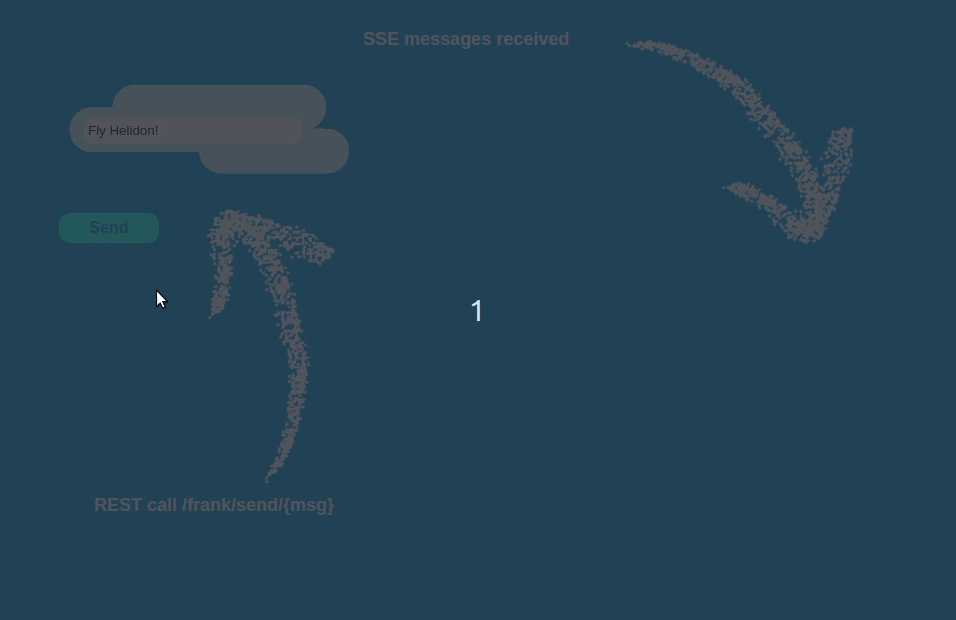

# Helidon Weblogic JMS demo project
Helidon messaging with WebLogic JMS demo project for Medium article [Helidon messaging with Weblogic JMS](https://medium.com/@danielkec/helidon-messaging-with-weblogic-jms-e05033a19040)

### Build and run local Weblogic with example queues

Accompanied bash script will download official [Oracle docker images](https://github.com/oracle/docker-images)
for a server [JRE 8](https://github.com/oracle/docker-images/tree/master/OracleJava/8), [Weblogic 12.2.1.3](https://github.com/oracle/docker-images/tree/master/OracleWebLogic/dockerfiles/12.2.1.3) and [sample domain](https://github.com/oracle/docker-images/tree/master/OracleWebLogic/samples/12213-domain). During docker images build,
script asks for downloading of server jre and Weblogic installation files. On JRE download page select `Linux x64` version and on Weblogic download page select `Oracle WebLogic Server 12.2.1.3`>`Quick Installer for Mac OSX,Windows and Linux`. After downloading and copying them to respective folders hit enter to continue.

| File | Destination | URL for download |
| --- | --- | --- |
| server-jre-8u271-linux-x64.tar.gz | ./target/ora-images/java/ | https://www.oracle.com/java/technologies/javase-server-jre8-downloads.html |
| fmw_12.2.1.3.0_wls_quick_Disk1_1of1.zip | ./target/ora-images/wls/12.2.1.3/| https://www.oracle.com/middleware/technologies/weblogic-server-downloads.html |

```shell
bash buildAndRunWeblogic.sh
...
> Download and copy server-jre-8u271-linux-x64.tar.gz to /home/kec/helidon-weblogic-jms-demo/target/ora-images/java/ 
> from https://www.oracle.com/java/technologies/javase-server-jre8-downloads.html
> Hit [ENTER] when ready to continue ...
> Download and copy fmw_12.2.1.3.0_wls_quick_Disk1_1of1.zip to /home/kec/helidon-weblogic-jms-demo/target/ora-images/wls/12.2.1.3/ 
> from https://www.oracle.com/middleware/technologies/weblogic-server-downloads.html
> Hit [ENTER] when ready to continue ...
...
> Waiting for WLS to start ...... [READY]
> Deploying example JMS queues
...
> Example JMS queues deployed!
> Console avaiable at http://localhost:7001/console with admin/Welcome1
```

### Extract wlthint3client.jar
When local docker container with Weblogic is up and running, execute script for extracting and installing Weblogic thin client to local maven repository. 
```shell
bash extractThinClientLib.sh
```
Thin client gets available in local maven repository as:
```xml
<dependency>
  <groupId>custom.com.oracle</groupId>
  <artifactId>wlthint3client</artifactId>
  <version>12.2.1.3</version>
</dependency>
```

### Build and run demo project
```shell
mvn clean package
java -jar ./target/helidon-wls-jms-demo.jar 
```

After Helidon starts, open http://localhost:8080/ and hit the `Send` button, which sends JMS message to `TestQueue` and also immediately receive the message from the very same queue. Reception of message is visually indicated by Frank, the Helidon bird, flying over the screen.

